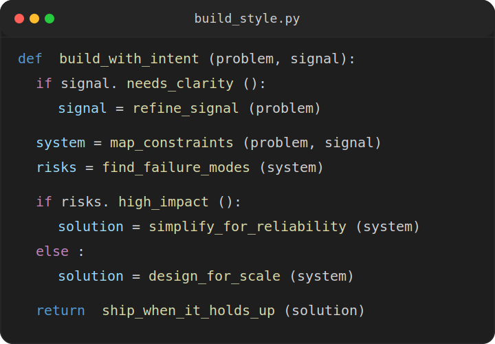
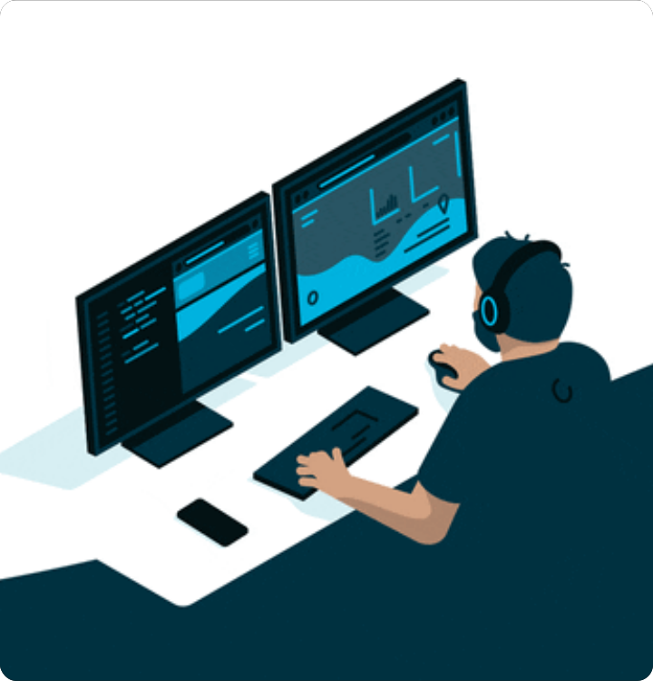

   
   

  
<strong>AI Researcher | Software Engineer | Applied ML Builder</strong>

  
I work across wireless systems, software engineering, and practical ML with a strong bias for reliable, thoughtful execution.

<table width="100%" cellpadding="0" cellspacing="0">
  <tr>
    <td width="60%" align="left" valign="top">
      
    </td>
    <td width="40%" align="right" valign="top">
      

        
      

    </td>
  </tr>
</table>

## About Me

- Project Research Associate at **IIT Bombay**, working on **5G core, wireless systems, and network experimentation**.
- **CSE graduate from VIT**, with a systems mindset and strong interest in infrastructure, protocols, and real deployments.
- I enjoy taking rough experiments, unclear failures, and messy setups and turning them into stable, understandable systems.
- Most of my work sits at the intersection of **systems thinking, software engineering, and hands-on debugging**.
- Best reached at [jindalpranav944@gmail.com](mailto:jindalpranav944@gmail.com).

## Current Signal

- **Building:** 5G core experiments, repeatable test setups, and cleaner workflows around systems work
- **Learning:** deeper telecom internals, observability, and ML workflows that support practical engineering
- **Looking for:** systems and software roles where debugging, reliability, and real-world behavior matter
- **Care about:** correctness, reproducibility, and work that holds up outside the demo

## Tech I Work With

   
  

   
  

## GitHub Pulse

  
  

  

---

  

