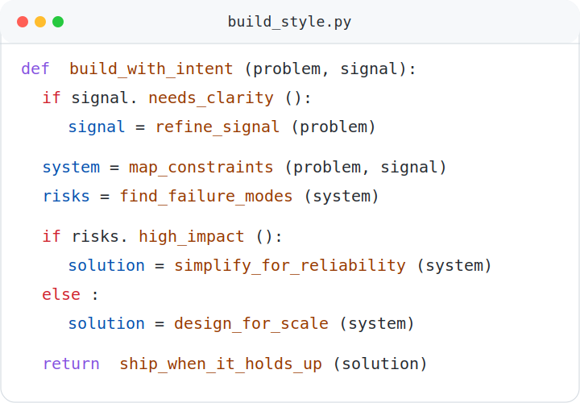

  <picture>
    <source media="(prefers-color-scheme: dark)" srcset="./assets/hero-typing.gif" />
    <source media="(prefers-color-scheme: light)" srcset="./assets/hero-typing-light.gif" />
    
  </picture> 
   

  
<strong>AI Researcher | Software Engineer | Applied ML Builder</strong>

  
I work across wireless systems, software engineering, and practical ML with a strong bias for reliable, thoughtful execution.

  <picture>
    <source media="(prefers-color-scheme: dark)" srcset="./assets/build-style-card.svg" />
    <source media="(prefers-color-scheme: light)" srcset="./assets/build-style-card-light.svg" />
    
  </picture>&nbsp;
  

## About Me

- Project Research Associate at **IIT Bombay**, working on **5G core, wireless systems, and network experimentation**.
- **CSE graduate from VIT**, with a systems mindset and strong interest in infrastructure, protocols, and real deployments.
- I enjoy taking rough experiments, unclear failures, and messy setups and turning them into stable, understandable systems.
- Most of my work sits at the intersection of **systems thinking, software engineering, and hands-on debugging**.
- Best reached at [jindalpranav944@gmail.com](mailto:jindalpranav944@gmail.com).

## Current Signal

- **Building:** 5G core experiments, repeatable test setups, and cleaner workflows around systems work
- **Learning:** deeper telecom internals, observability, and ML workflows that support practical engineering
- **Looking for:** systems and software roles where debugging, reliability, and real-world behavior matter
- **Care about:** correctness, reproducibility, and work that holds up outside the demo

## Tech I Work With

  <picture>
    <source media="(prefers-color-scheme: dark)" srcset="./assets/core-label.svg" />
    <source media="(prefers-color-scheme: light)" srcset="./assets/core-label-light.svg" />
    
  </picture> 
  

  <picture>
    <source media="(prefers-color-scheme: dark)" srcset="./assets/also-comfortable-with-label.svg" />
    <source media="(prefers-color-scheme: light)" srcset="./assets/also-comfortable-with-label-light.svg" />
    
  </picture> 
  

## GitHub Pulse

  <picture>
    <source media="(prefers-color-scheme: dark)" srcset="./assets/github-stats.svg" />
    <source media="(prefers-color-scheme: light)" srcset="./assets/github-stats-light.svg" />
    
  </picture><picture>
    <source media="(prefers-color-scheme: dark)" srcset="./assets/github-streak.svg" />
    <source media="(prefers-color-scheme: light)" srcset="./assets/github-streak-light.svg" />
    
  </picture>

  <picture>
    <source media="(prefers-color-scheme: dark)" srcset="./assets/github-activity-graph.svg" />
    <source media="(prefers-color-scheme: light)" srcset="./assets/github-activity-graph-light.svg" />
    
  </picture>

## Let it slither 🐍

  <picture>
    <source media="(prefers-color-scheme: dark)" srcset="https://raw.githubusercontent.com/pranavjindal29/pranavjindal29/output/github-snake-dark.svg" />
    <source media="(prefers-color-scheme: light)" srcset="https://raw.githubusercontent.com/pranavjindal29/pranavjindal29/output/github-snake.svg" />
    
  </picture>

