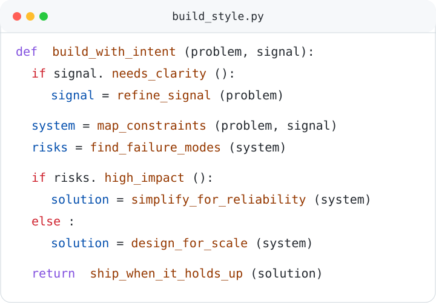

  <picture>
    <source media="(prefers-color-scheme: dark)" srcset="./assets/hero-typing.gif" />
    <source media="(prefers-color-scheme: light)" srcset="./assets/hero-typing-light.gif" />
    
  </picture> 
   

  
<strong>Software Engineer | Distributed Systems | 5G Networks</strong>

  
I build reliable Python tooling for telecom control-plane analysis, automation, and distributed test environments, backed by 5G research.

  <picture>
    <source media="(prefers-color-scheme: dark)" srcset="./assets/build-style-card.svg" />
    <source media="(prefers-color-scheme: light)" srcset="./assets/build-style-card-light.svg" />
    
  </picture>&nbsp;
  

## Engineering Profile

- **Project Research Associate at IIT Bombay**, working on **5G core, wireless networks, and control-plane experimentation**.
- I develop Python-based automation for repeatable experiments, system analysis, and cross-component failure diagnosis.
- Beyond telecom, I have hands-on experience building distributed data workflows with **PySpark, PostgreSQL, and Docker**.
- **CSE graduate from VIT**, interested in backend engineering, infrastructure, networking, and distributed systems.
- I value clear system behavior, observable failures, reproducibility, and software that remains reliable beyond the demo.
- Best reached at [jindalpranav944@gmail.com](mailto:jindalpranav944@gmail.com).

## Current Direction

- **Strengthening:** observability and reliable automation for complex systems
- **Deepening:** fault-tolerant distributed-system design and telecom internals
- **Open to:** backend, infrastructure, networking, and distributed-systems engineering roles

## Tech I Work With

  <picture>
    <source media="(prefers-color-scheme: dark)" srcset="./assets/core-label.svg" />
    <source media="(prefers-color-scheme: light)" srcset="./assets/core-label-light.svg" />
    
  </picture> 
  

  
<strong>View broader toolkit</strong>

   

  

    <picture>
      <source media="(prefers-color-scheme: dark)" srcset="./assets/also-comfortable-with-label.svg" />
      <source media="(prefers-color-scheme: light)" srcset="./assets/also-comfortable-with-label-light.svg" />
      
    </picture> 
    
  

## GitHub Pulse

  <picture>
    <source media="(prefers-color-scheme: dark)" srcset="./assets/github-stats.svg" />
    <source media="(prefers-color-scheme: light)" srcset="./assets/github-stats-light.svg" />
    
  </picture><picture>
    <source media="(prefers-color-scheme: dark)" srcset="./assets/github-streak.svg" />
    <source media="(prefers-color-scheme: light)" srcset="./assets/github-streak-light.svg" />
    
  </picture>

<!-- 

  <picture>
    <source media="(prefers-color-scheme: dark)" srcset="./assets/github-activity-graph.svg" />
    <source media="(prefers-color-scheme: light)" srcset="./assets/github-activity-graph-light.svg" />
    
  </picture>

 -->

## Let it slither 🐍

  <picture>
    <source media="(prefers-color-scheme: dark)" srcset="https://raw.githubusercontent.com/pranavjindal29/pranavjindal29/output/github-snake-dark.svg" />
    <source media="(prefers-color-scheme: light)" srcset="https://raw.githubusercontent.com/pranavjindal29/pranavjindal29/output/github-snake.svg" />
    
  </picture>

